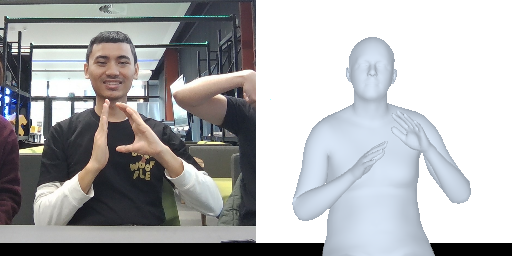
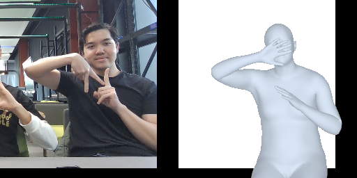

# Project Human Mesh Recovery (HMR)
A lightweight implementation of a vision transformer, and cross-attention based transformer decoder network for 3D human mesh recovery, and reconstruction on SMPL models from RGB images, with the potential of further development into RGB videos, and RGB live videos.

Implemented using PyTorch Lightning, and based on the research paper titled, ["Humans in 4D: Reconstructing and Tracking Humans with Transformers"](https://shubham-goel.github.io/4dhumans/).

## Requirements

### Dependencies

We have provided conda environment spec in the `environment.yml` file.
You can set-up the environment using the command below. It will create a new
environment named `HMR`.

```bash
conda env create --file environment.yml
```

### Required Files
The following files are required to run `demo.sh` and `train.sh`.

All of the files are located in this [Google Drive](https://drive.google.com/drive/folders/1gwPu7umbOtAhpKt2stLFmqmiMMF9H7b6?usp=sharing)

- `SMPL_NEUTRAL.pkl` - SMPL Neutral Model
- `smpl_mean_params.npz` - SMPL Mean Parameters
- `SMPL_to_J19.pkl` - SMPL Joint Regressor Extra
- `vitpose_small_backbone.pth` - Pre-trained ViTPose-S with Classic Decoder
- `epoch_0086-step_000086130.ckpt` - Our HMR checkpoint training file

## Training Logs

We used MLFlow to log hyperparameters, metrics, and checkpoint artifacts.
MLFlow should already be installed if you set-up the environment using the previous guide.

Note that the training code requires you to have an mlflow ui/server running.

Simply run the command below in this directory to spin up MLFlow UI.

```bash
# run this when the current working directory is the same as this README.md
mlflow ui
```

We have provided `mlruns` folder that contains our training logs. You should be 
able to see our training logs when you open the mlflow ui in the browser.

## Runing the Demo

You can run the demo by running the `demo.py`. Please consult the `demo.sh` for 
required command line arguments, or run `python demo.py --help`.

## Training

### Dataset

To do training, you need to download the datasets from the [4DHumans](https://github.com/shubham-goel/4D-Humans) repo. 
You should put the datasets at `/opt/ml/data/MDN`. Consult the `IMAGE_DATASETS` on `hmr/datasets/datamodule.py` for exact folder structure.

You should also have a running mlflow instance.

To run the training, change the arguments on the `train.sh` and execute it, or you can run the `train.py` by providing required arguments.

## Sample Outputs





## Acknowledgements
Parts of the code are taken or adapted from the following repos:
- [4DHumans](https://github.com/shubham-goel/4D-Humans)
- [ViTPose](https://github.com/ViTAE-Transformer/ViTPose?tab=readme-ov-file)
- [SMPLIFY-X](https://github.com/vchoutas/smplify-x)
- [detectron2](https://github.com/facebookresearch/detectron2)